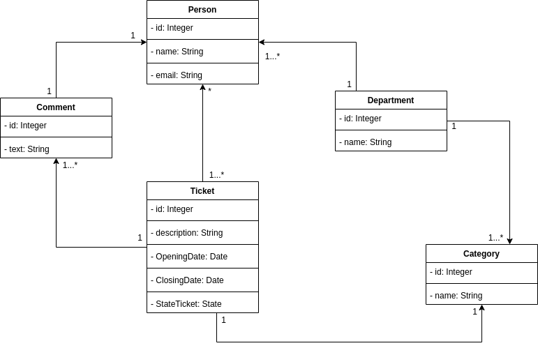
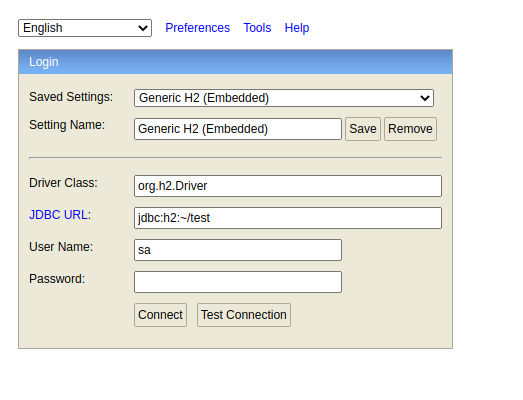

# TicketOpen API
The objective of this project is to build an API, thinking about a task management system.

### Diagram of Relational Objects


### Technology
* [Java 11](https://www.oracle.com/java/technologies/javase-jdk11-doc-downloads.html)
* [Maven](https://maven.apache.org/guides/index.html)
* [Spring Boot 2.3](https://docs.spring.io/spring-boot/docs/current/reference/htmlsingle/)
* [MySQL](https://dev.mysql.com/doc/)
* [Heroku](https://devcenter.heroku.com/categories/reference)

### Running application - Local

By default, application.properties is config to run Local

```
Run the class TicketOpenApplication.java
```

By default, the H2 database is configured on port 8080
```
http://localhost:8080/h2-console
```


### About more project

This backend is hosted on Heroku to serve these screens
* [SGA Adobe XD](https://xd.adobe.com/view/40d8efc4-2e34-41e3-b5c9-6facdbc31ca4-158b/)

Repo front
* [TicketOpen](https://github.com/Raafa1993/TicketOpen)
